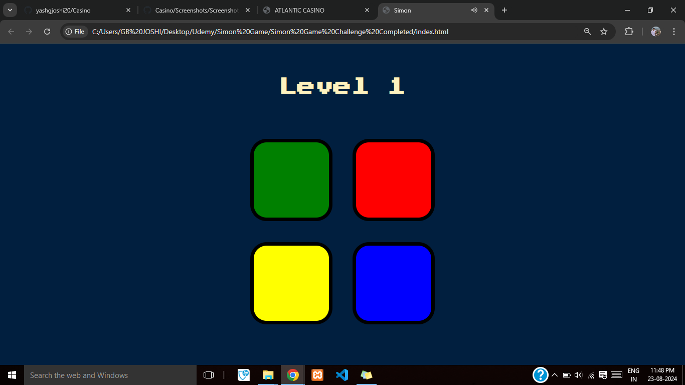
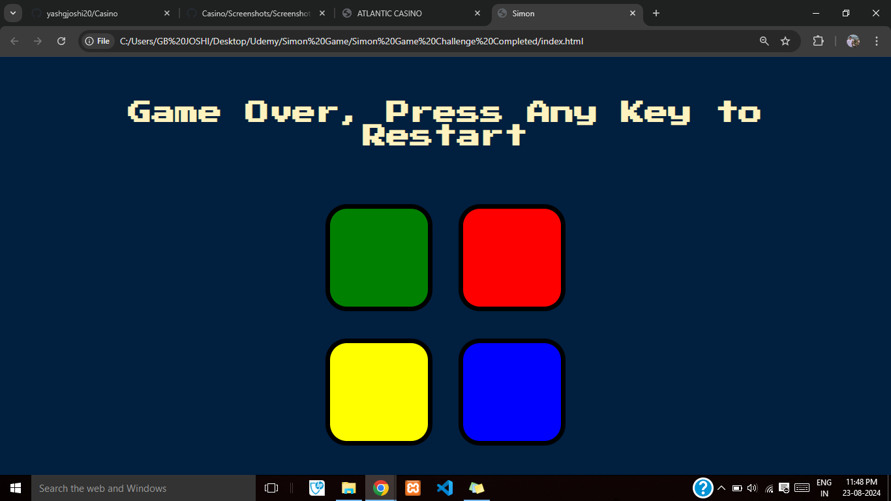

# Simon-Game - The Simon game is a classic electronic memory game where players must replicate increasingly complex sequences of lights and sounds.

The game has four colored buttons (usually red, green, yellow, and blue) that light up and beep in a specific order. The player has to press the buttons in the same sequence to progress. The sequence gets longer and more complex with each round, testing the player’s memory and concentration. It’s a fun and challenging way to exercise your brain and improve memory skills.

## Screenshots:
### 1- Screenshot-1

### 2- Screenshot-2

### Links

- Solution URL:  [Solution  URL](https://github.com/yashgjoshi20/Simon-Game.git)

### Built with

- Semantic HTML5 markup
- CSS custom properties
- Flexbox
- CSS Grid
- Mobile-first workflow

For the website I've used the following resources:
* ***Icons***: [FlatIcons](https://www.flaticon.com/)
* ***Fonts***: [GoogleFonts](https://fonts.google.com/)
* ***Bootstrap***: [Bootstrap](https://getbootstrap.com/)
* ***External Packagers***: [NPM](https://www.npmjs.com/)

 ## Author

- GitHub - Yash Joshi (https://github.com/yashgjoshi20)
